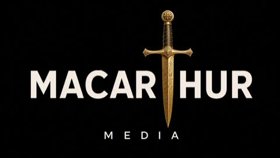
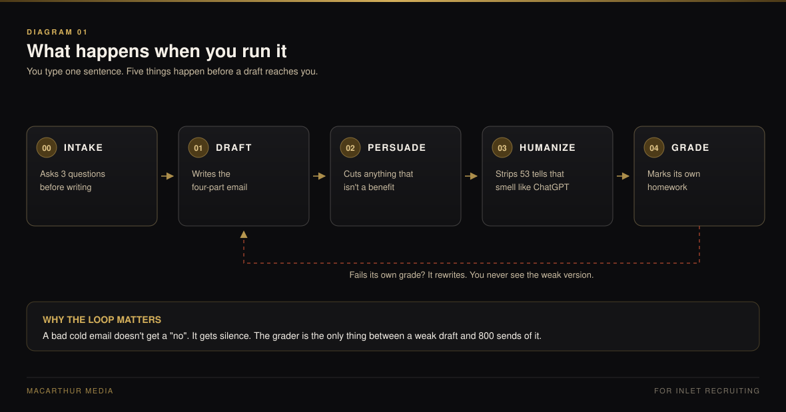
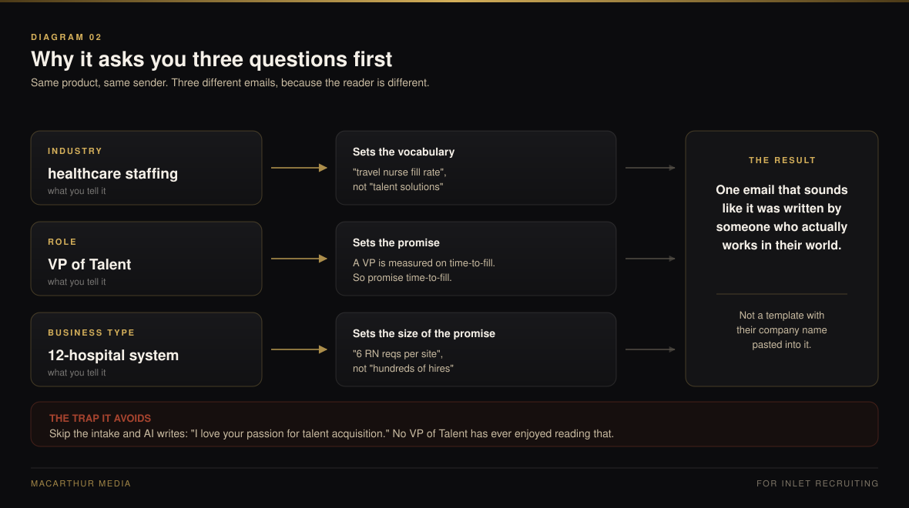
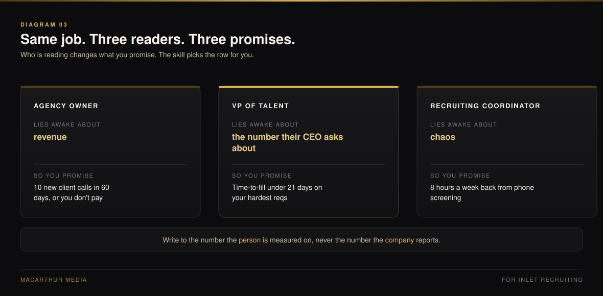
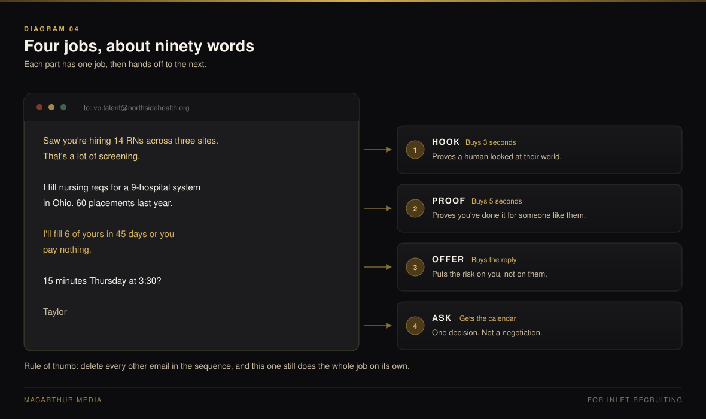
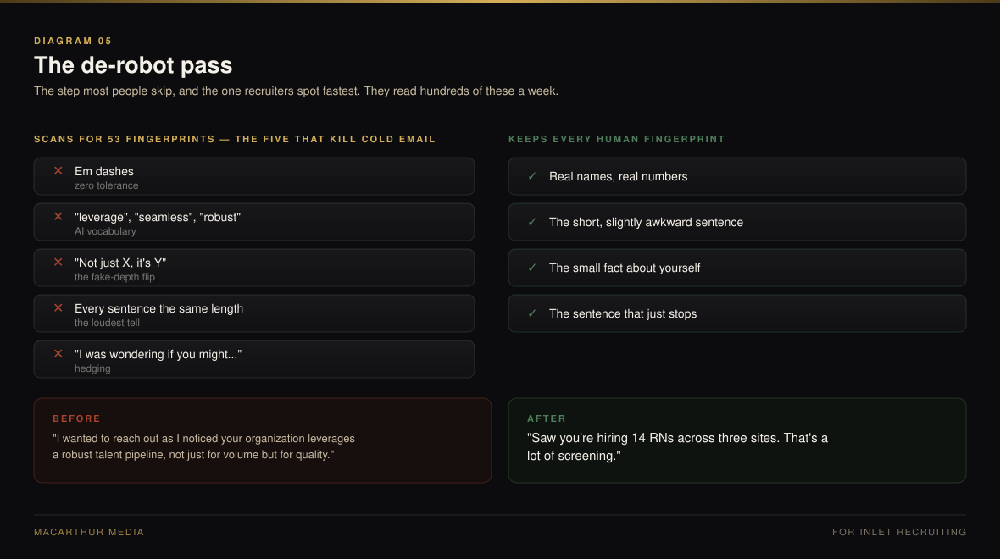
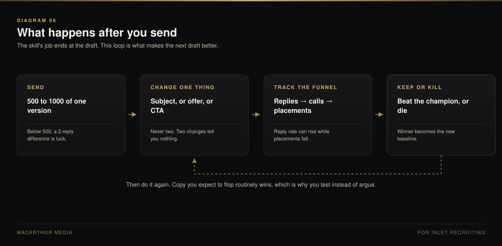

  

<b>Built by MacArthur Media for Inlet Recruiting</b>

---

# How this works — in plain English

Six pictures, no jargon. Every example is a recruiting one: you place candidates,
and you are emailing the person who does the hiring.

The writing framework underneath is **Nick Saraev's four-part cold email formula**.
Everything here is that formula, plus two editing passes and a grader.

---

## 1. What happens when you run it

You type one sentence. It asks three questions, writes the email, edits it twice,
then marks its own homework. A draft only reaches you once it passes.

---

## 2. Why it asks you three questions first

Industry sets the words. Role sets the promise. Business type sets how big the
promise can get before it stops being believable.

---

## 3. Same job, three readers, three promises

An owner, a VP, and a coordinator are not buying the same thing. Write to the
number the person is measured on.

---

## 4. What the four parts actually do

This is Saraev's structure. Four jobs, about ninety words, each one buying you
the right to the next line.

---

## 5. The de-robot pass

The step most people skip, and the one recruiters spot fastest. They read
hundreds of these a week.

---

## 6. What happens after you send

The skill's job ends at the draft. This loop is what makes the next one better.

---

  

MacArthur Media · built for Inlet Recruiting

