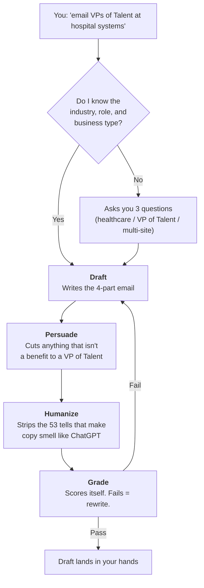
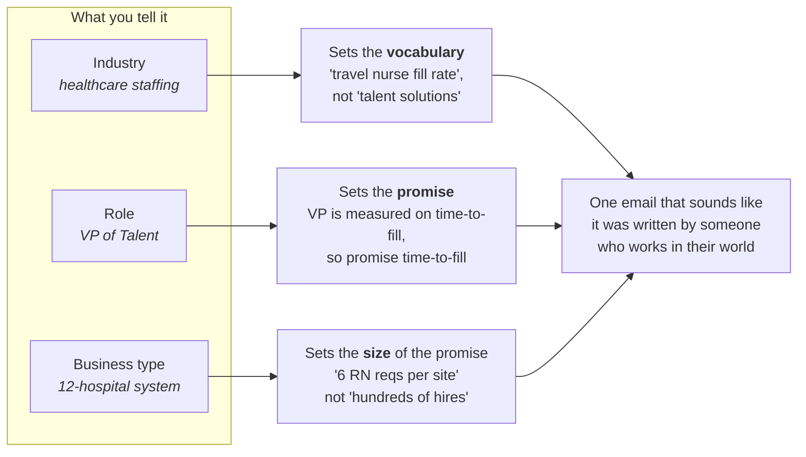
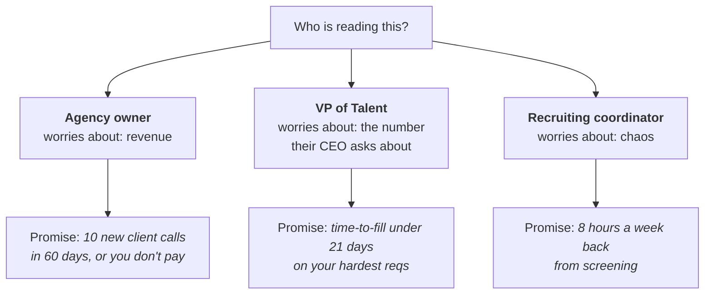
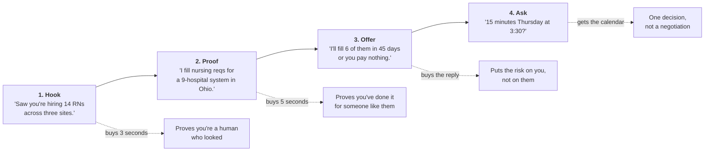
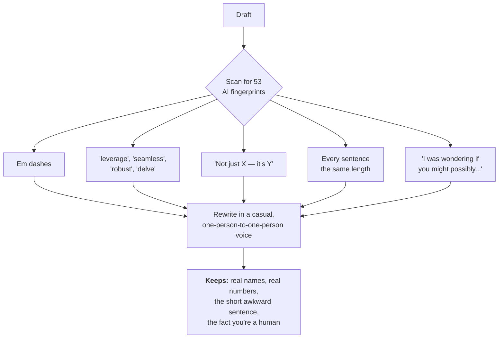
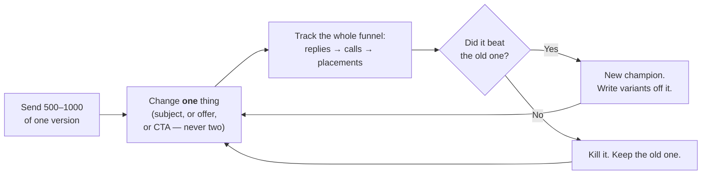

  

<b>Built by MacArthur Media for Inlet Recruiting</b>

---

# How this works — in plain English

Every example here is an Inlet Recruiting one: you place candidates, and you are
emailing the person who does the hiring.

---

## 1. The whole machine

You give it a sentence. It asks you three questions. Then it writes, edits,
de-robots, and marks its own homework before you ever see the draft.

**Why the loop matters:** a bad cold email doesn't get a "no", it gets silence.
The grader is the only thing standing between a weak draft and 800 sends of it.

---

## 2. Why it asks those three questions

Same product, same sender. Three different emails, because the reader is
different. This is the whole reason the intake exists.

**The trap it avoids:** without this, AI writes "I love your passion for talent
acquisition." No VP of Talent has ever loved receiving that sentence.

---

## 3. Same job, three readers

Who you're writing to changes what you promise. The skill picks the row for you.

---

## 4. What the four parts actually do

A cold email is four jobs in about 90 words. Each part has one job and hands off
to the next.

**Rule of thumb:** if you deleted every other email in the sequence, this one
should still do the whole job on its own.

---

## 5. The de-robot pass

This is the step most people skip, and it's the one recruiters notice fastest —
they read hundreds of these a week.

**Before:** "I wanted to reach out as I noticed your organization leverages a
robust talent pipeline — not just for volume, but for quality."

**After:** "Saw you're hiring 14 RNs across three sites. That's a lot of screening."

---

## 6. What happens after you send

The skill's job ends at the draft. This is what makes the next draft better.

**Why volume:** at 50 sends, a 2-reply difference is luck. At 800, it's a fact.

---

  

MacArthur Media · built for Inlet Recruiting

